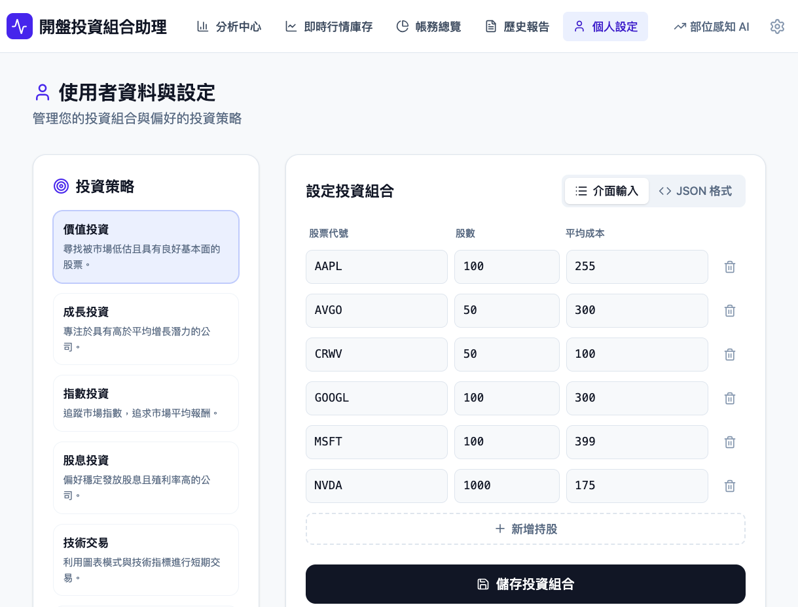
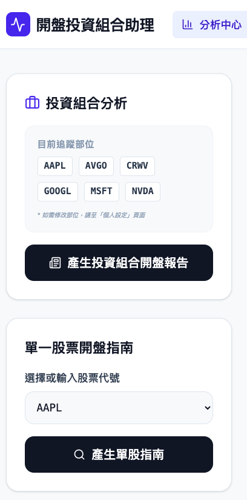
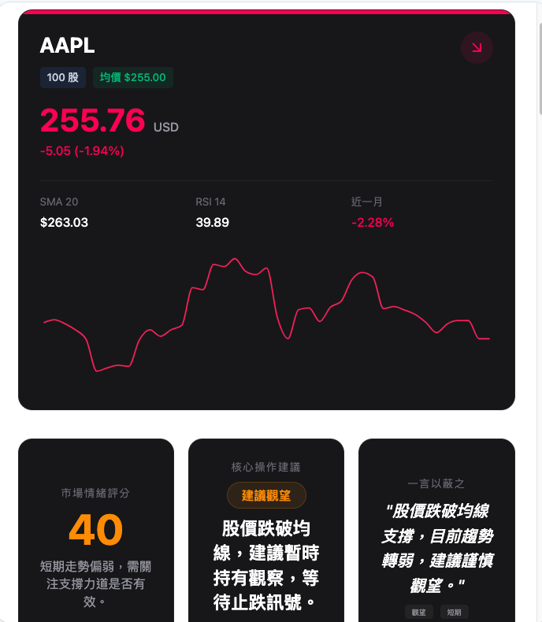
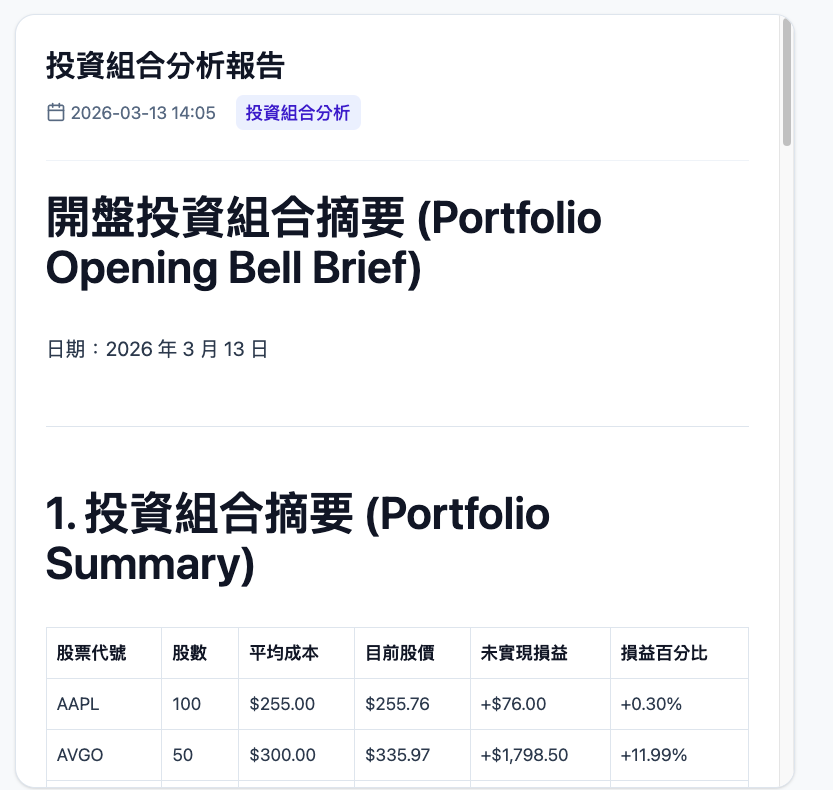
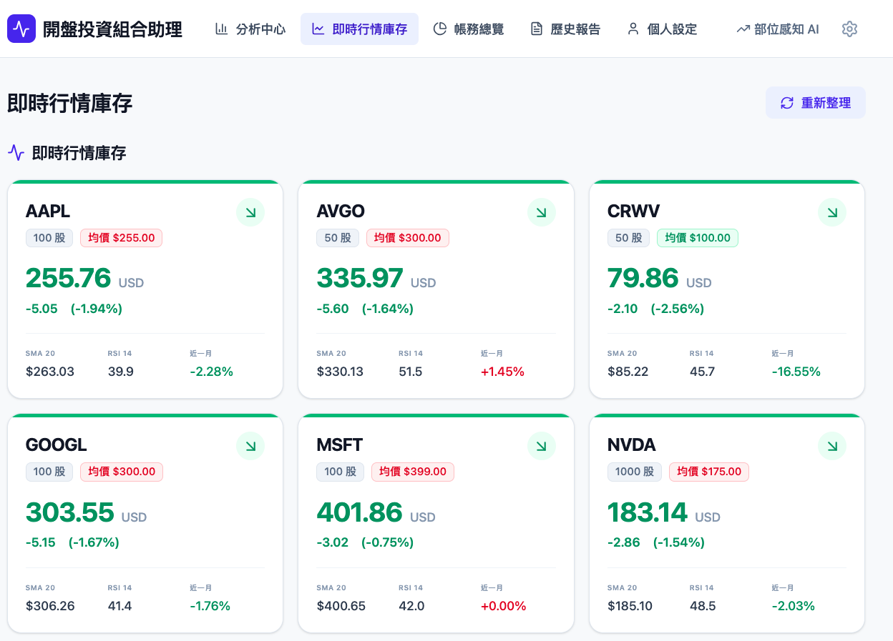
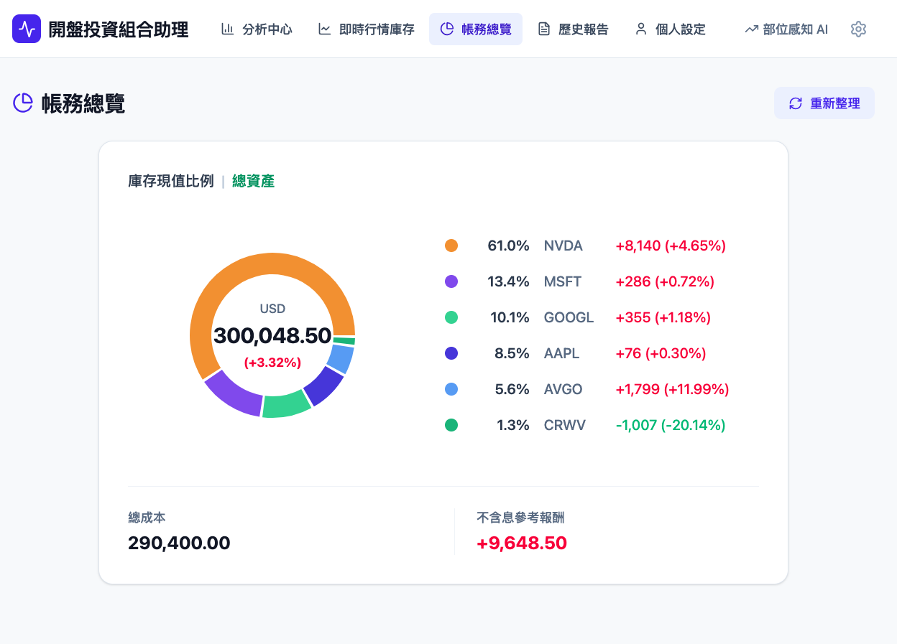

# Portfolio Opening Bell Agent

部位感知的 AI 投資組合助理：結合您的持股、即時行情與新聞，產出開盤指南與決策儀表盤，支援趨勢交易策略與風險排查。

---

## 概述

- **分析中心**：輸入投資組合或單一標的，一鍵產生開盤報告或單股決策儀表盤。
- **部位感知 AI**：依您的持股（張數、均價）與即時市價，計算損益與報酬率，並在分析中納入部位情境。
- **決策儀表盤（單股）**：趨勢狀態、均線與乖離、買/賣/觀望建議、風險點、支撐壓力、成交量等，以結構化卡片與圖表呈現。
- **投資組合開盤報告**：針對多檔持股的 AI 開盤摘要，含新聞與市場脈動。
- **即時行情庫存**：以您儲存的投資組合為基礎，顯示各標的即時價、漲跌、與均價比較。
- **帳務總覽**：投資組合總成本、總市值、損益與報酬率，並以圓餅圖呈現部位占比。
- **歷史報告**：儲存單股/組合報告，支援檢視、下載 PDF、匯出 ZIP。
- **個人設定**：維護投資組合（代號、股數、均價）、投資策略（成長/價值/平衡）；系統設定可自訂 Gemini API Key。


### 分析中心
<!-- 股票配置 -->


<!-- 分析中心首頁 -->


### 單股決策儀表盤

<!-- 單股分析結果 -->



### 投資組合開盤報告

<!-- 組合報告 -->



### 即時行情與帳務

<!-- 行情庫存 -->


<!-- 帳務總覽 -->


---

## 本地執行（Run Locally）

**環境需求：** Node.js

1. 安裝依賴：
   ```bash
   npm install
   ```
2. 建立 `.env.local` 並設定：
   ```
   VITE_GEMINI_API_KEY=<your_gemini_api_key>
   ```
3. 啟動開發伺服器：
   ```bash
   npm run dev
   ```

亦可於應用內「系統設定」中填入自訂 Gemini API Key，無需寫入 `.env.local`。

---

## 技術架構與資料流

### 資料來源與 API 整合

- **行情與技術指標（股票現狀）**  
  後端使用 **Yahoo Finance（yahoo-finance2）** 取得即時與歷史資料，供 AI 分析「股票現狀」：
  - **即時報價**：`quote(ticker)` — 現價、漲跌、漲跌幅、成交量、市值。
  - **歷史 K 線**：近 60 日日線，用於計算 **SMA20**、**RSI(14)**、**近一個月報酬率**，並產出價格走勢圖資料。
  - **大盤情境**：`/api/market-context` 取得 NASDAQ (^IXIC)、S&P 500 (^GSPC) 指數漲跌幅，作為市場氛圍脈絡。

- **最新消息**  
  新聞來源採 **Gemini + 外部新聞 API** 雙軌：
  - **SERP API（SerpAPI）**：若在系統設定中填入 Serp API Key，後端會以 Google 新聞搜尋（`engine=google&tbm=nws`）取得各標的最新相關新聞（每標的最多 3 筆），再連同行情一併送入 Gemini 做摘要與風險提示。
  - **Yahoo Finance 新聞**：未設定 Serp API Key 時，改以 `yahooFinance.search(ticker, { newsCount: 3 })` 取得該標的新聞，同樣彙整後交給 Gemini。

- **AI 分析（Gemini）**  
  - **單股決策儀表盤**：將「即時報價 + SMA20/RSI/近月績效 + 新聞 + 大盤情境 + 使用者部位（可選）」組成 prompt，搭配 **structured output（responseSchema）** 產出 JSON 儀表盤（趨勢、買賣建議、風險、支撐壓力等）；system instruction 內建嚴進策略、趨勢交易、籌碼與買點規則，並要求繁體中文、禁止幻覺與重複句。
  - **投資組合開盤報告**：對多檔持股並行拉取行情與新聞，再呼叫 Gemini 產出開盤摘要與建議。
  - API Key 可來自 `VITE_GEMINI_API_KEY` 或應用內「系統設定」的自訂 Key；模型可選（例如 `gemini-3-flash-preview`）。

### 後端與前端分工

- **後端（Express）**：`/api/market-data`（行情+技術指標）、`/api/news`（SerpAPI 或 Yahoo 新聞）、`/api/market-context`（大盤）；集中處理 Yahoo 與 SerpAPI 呼叫，前端僅傳 tickers 與可選的 `serpApiKey`。
- **前端**：Vite + React，依序或並行呼叫上述 API，再將結果與使用者部位一併送入 Gemini 服務（`geminiService.ts`），並負責儀表盤與報告的展示、儲存與 PDF 匯出。
